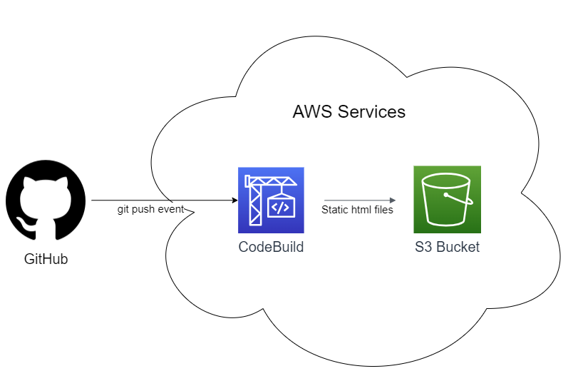

# HUGO site Continuous Deployment using AWS s3
I created this repo as part of @noahgift's [Cloud Computing Foundations Coursera Course](https://www.coursera.org/learn/cloud-computing-foundations-duke/home/welcome). Use this code along with the below deployment guide to spin up a basic static HUGO site in the cloud.

Link to site: http://personalsitejoeheflin.s3-website.us-east-2.amazonaws.com
## Overview

