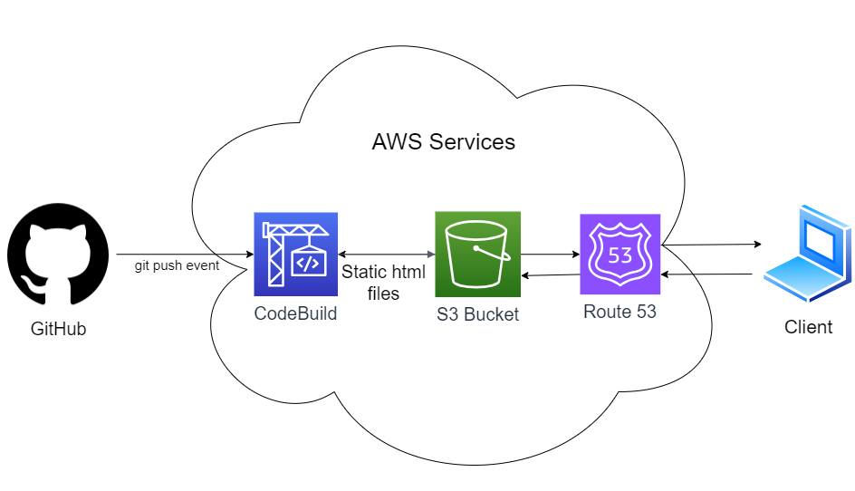

# HUGO site Continuous Deployment
I built a personal portfolio site as an extension of a project I completed as part of @noahgift's [Cloud Computing Foundations Coursera Course](https://www.coursera.org/learn/cloud-computing-foundations-duke/home/welcome).

Link to site: http://joeheflin.com
## Overview

## Authors
@JoeHeflin, Hugo theme template by @charlola
